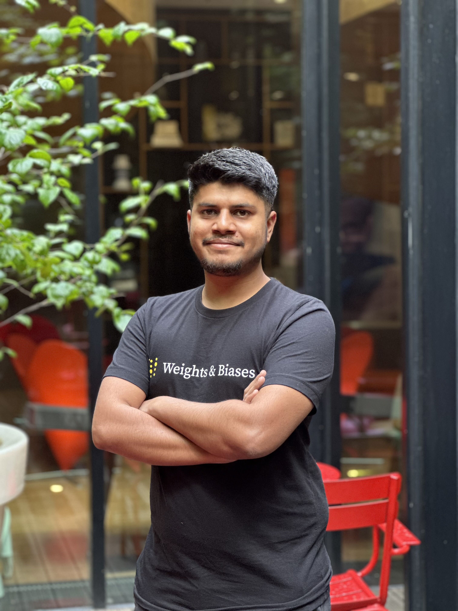

<header class="hero">

# Ayush Thakur

I build and evaluate AI systems.

I am a **Manager, AI Engineering** at [Weights & Biases](https://wandb.ai/) by CoreWeave. I work on internal coding agents, harness benchmarks, memory, and methods for learning from previous runs.

Previously, I was a growth MLE at W&B. I built [open-source integrations](work.qmd#tools-and-integrations), production RAG systems such as [Wandbot](http://wandb.me/wandbot-refactor), [technical courses](work.qmd#courses), and [practical ML writing](blog/index.qmd). This work helped developers adopt W&B across training, evaluation, and LLM application workflows.

I started with autonomous robots and computer vision. Those projects taught me to work quickly, test ideas in hardware and code, and own the result. I am looking for research collaborators working on agents, memory, and learning from experience.

[GitHub](https://github.com/ayulockin) · [LinkedIn](https://www.linkedin.com/in/ayush-thakur-731914149/) · [Kaggle](https://www.kaggle.com/ayuraj) · [Writing](blog/index.qmd)

</header>

## News

::: {.news}

2026
Won a solo <strong>silver medal</strong>, ranking 132nd of 4,729 teams, in Kaggle [*Orbit Wars*](https://www.kaggle.com/competitions/orbit-wars/overview).

2025
Started leading AI engineering work at W&B.

2025
Shipped evaluation and observability support for the [NVIDIA NeMo Agent Toolkit](https://wandb.ai/wandb_fc/nvidia-nat-ata/reports/Tracking-and-optimizing-agentic-workflows-using-W-B-Weave-and-NVIDIA-NeMo-Agent-Toolkit---VmlldzoxNDQ4NjgyNg).

2025
Released [LLM apps: Evaluation](https://wandb.ai/site/courses/evals/), created with Anish Shah and guest instructors from Google and All Hands AI.

2024
Released [RAG++](https://wandb.ai/site/courses/rag/) and published the results of the Wandbot refactor.

:::

## Experience in brief

::: {.experience-list}
::: {.experience-item}
2025–now

<strong>Manager, AI Engineering · W&B by CoreWeave</strong> Agent engineering, internal productivity, evaluation harnesses, and applied research.

:::

::: {.experience-item}
2020–2025

<strong>Machine Learning Engineer · Weights & Biases</strong> Open-source integrations, LLM evaluation, Wandbot, courses, Kaggle programs, and technical education.

:::

::: {.experience-item}
2020

<strong>Technical Author · Weights & Biases</strong> Technical reports on deep learning, computer vision, and practical ML engineering.

:::
:::

[More about my work →](work.qmd)

## Writing and teaching

I have published **70 technical reports** and **73 public notebooks** across LLM systems, RAG, deep learning, computer vision, generative modeling, training infrastructure, and applied ML. I have also helped create three free technical courses and spoken at W&B events, DataHack Summit, GDG communities, and local ML workshops.

- [Explore the bodies of work →](blog/index.qmd#bodies-of-work)
- [Browse the complete writing archive →](blog/index.qmd#complete-archive)
- [Talks and workshops →](talks.qmd)

## Publication

::: {.project}

2020 IEEE ICCE

<strong>[Feature extraction and classification of phonocardiograms using convolutional neural networks](https://ieeexplore.ieee.org/abstract/document/9290565/)</strong> With Devjyoti Chakraborty, Snehangshu Bhattacharya, Aritra Roy Gosthipaty, and Chira Datta. We transformed heart-sound recordings into spectrograms and used convolutional neural networks to classify normal and abnormal phonocardiograms.[IEEE](https://ieeexplore.ieee.org/abstract/document/9290565/) · [Google Scholar](https://scholar.google.com/citations?hl=en&user=KYYiO60AAAAJ)

:::

## Earlier

I studied Electronics and Communication Engineering at Netaji Subhash Engineering College, Kolkata. During college I built line followers, maze solvers, and a grid-navigation robot that avoided obstacles and retraced the shortest route.

[Read the longer background →](about.qmd)

